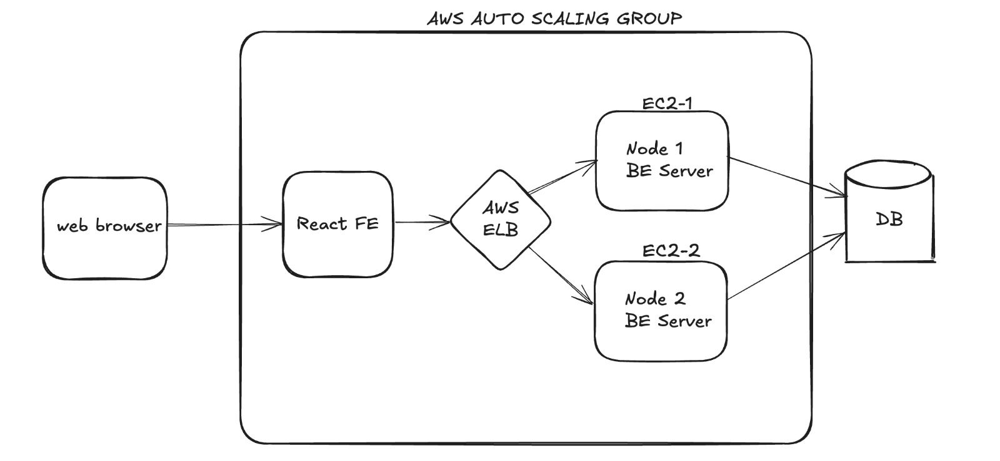

## BookTable (Hotel Mania)

BookTable is a cloud-native, full-stack reservation system that simplifies everything from customer bookings to back-of-house operations and administrative control. Built for high scalability and robust security, it implements granular, policy-driven role-based access controls for diners, restaurant staff, and platform administrators alike.

## User Roles & Features

### Customer
- **Account Management:** Register and log in securely using JWT  
- **Reservation Search:** Filter by date, time, party size, and location (city/state or ZIP)  
- **Availability Overview:** View open slots within a ±30-minute window, with restaurant name, cuisine, price tier, ratings, and today’s booking count  
- **Booking & Cancellation:** Reserve or cancel tables with instant email/SMS confirmations  
- **Reviews Browser:** Read customer feedback for each restaurant  
- **Profile Settings:** Access and update personal details

### Restaurant Manager
- **Secure Login:** Authenticate via JWT for manager access  
- **Listing Management:** Create or update restaurant profiles (name, address, contact details, operating hours)  
- **Table Configuration:** Define initial table layouts and available booking times  
- **Content Updates:** Edit restaurant descriptions and upload photo galleries

### Administrator
- **Listing Approval:** Vet and publish new restaurant submissions  
- **Reservation Dashboard:** Monitor daily booking requests with real-time accept/decline controls  

---

### Tech Stack

- **Deployment:** AWS EC2, S3  
- **Database:** MongoDB  
- **Monitoring:** AWS CloudWatch.  
- **Backend:** Node.js, Express.js.
- **Frontend:** React.js, CSS, Styled Components.
- **Authentication:** JWT  

---

## Feature Overview

### Application Architecture
- MVC separation between Express controllers, service-layer logic, and Mongoose models

### Authentication & Security
- Stateless JWT tokens for role-based access (Customer, Manager, Admin)  
- bcrypt for secure password hashing  
- Enforced HTTPS, strict CORS policies, and rate limiting on sensitive endpoints

### External Integrations
- Google Maps Places API for geolocation and embedded maps  
- AWS S3 for storing and serving restaurant photos  
- Nodemailer for sending booking confirmations via email/SMS

### Deployment & Infrastructure
- **Frontend:** React.js hosted on AWS S3 and distributed via CloudFront  
- **Backend:** Node.js + Express APIs on an auto-scaling EC2 fleet  
- **Database:** MongoDB Atlas managed cluster

---

### Diagrams

